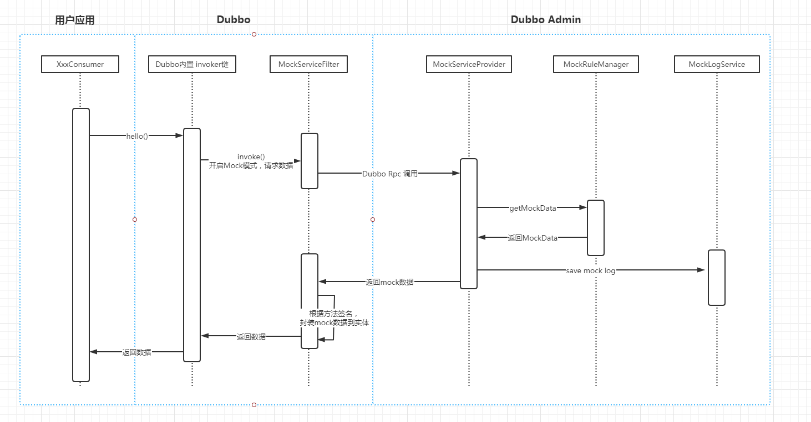

# 模块作用

提供给dubbo用户用于在没有服务提供者的情况下模拟返回数据的模块，只需要配合dubbo-admin就可以在没有服务提供者的情况下轻松模拟返回数据。 在开发过程中无需等待服务提供方将服务提供者实现开发和部署完成才能进行后续开发和测试，减少对服务提供者的依赖造成的阻塞，提升开发效率。

## 整个mock流程

## 如何使用

在Consumer端加入 mock-admin 依赖，然后使用 -Denable.dubbo.admin.mock=true 进行开启

应该是 admin 那边会注册 mock相关的interface到注册中心，然后这边这个filter如果生效的话，会根据consumer的url中的registry找mock interface的地址，然后进行代理，将请求往那边发

 
