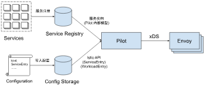

# 通讯方式

- endpoint：一个具体的“应用实例”，对应ip和端口号，类似Kubernetes中的一个pod。
- cluster：一个cluster是一个“应用集群”，它对应提供相同服务的一个或多个endpoint。cluster类似Kubernetes中service的概念，即一个Kubernetes service对应一个或多个用同一镜像启动，提供相同服务的pod。
- route：当我们做灰度发布、金丝雀发布时，同一个服务会同时运行多个版本，每个版本对应一个cluster。这时需要通过route规则规定请求如何路由到其中的某个版本的cluster上。

以上这些内容实际上都是对Envoy等proxy的配置信息，而所谓的cluster discovery service、route discovery service等xxx discovery service就是Envoy等从pilot-discovery动态获取endpoint、cluster等配置信息的协议和实现。为什么要做动态配置加载，自然是为了使用istioctl等工具统一、灵活地配置service mesh。

而为什么要用ads来“聚合”一系列xds，并非仅为了在同一个gRPC连接上实现多种xds来省下几个网络连接，ads还有一个非常重要的作用是解决cds、rds信息更新顺序依赖的问题，从而保证以一定的顺序同步各类配置信息
